  

 

### About

I'm an Electrical Engineering student at the Lassonde School of Engineering, with my first year complete, and the Schulich Leader Scholarship supporting the ride!

Most of my projects start off as tiny inconveniences: reaching for a keyboard during a presentation, having to lock the house (such a drag!), or beating my family at checkers. I like turning these little frustrations into projects that come to life. Come follow along with my journey!

 

### My Tools

  

 

### My Socials

  
  &nbsp;&nbsp;
  
  &nbsp;&nbsp;
  
  &nbsp;&nbsp;
  

 

### Résumé

<!-- Replace # with your resume link when ready. -->
> [!IMPORTANT]
> **Important - dear employers...**
>
> [View my CV.](#)

